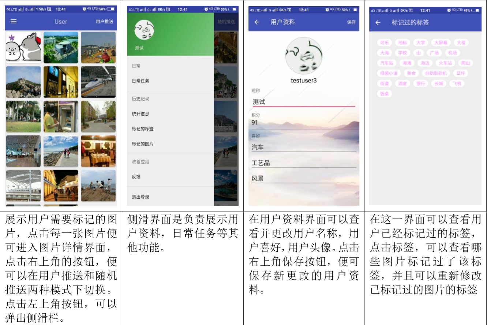
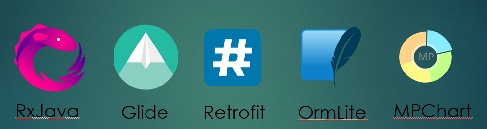

图片认知分类项目，android客户端代码
# 项目展示（附有演示视频）

# 使用的技术框架

# 项目介绍
图片识别神经网络需要大量训练数据，本项目的目的就是收集图片及图片的类别信息，用来提供给神经网络训练。服务端会先将待推送给客户端的图片进行初步的图片识别，给出图片的初始分类，将图片和图片的初始分类及其他用户标记的该图片的分类推送给客户端。客户端可以参考已有分类对图片进行标注，并提交给服务器。服务器将收集到的信息过滤聚类后形成统一的图片分类信息，该信息可以看做图片所包含的真实信息。
# 服务端使用TensorFlow预训练模型
服务端使用TensorFlow预训练模型，使用训练好的模型识别待推送给客户端的图片，给出图片的初始分类。
